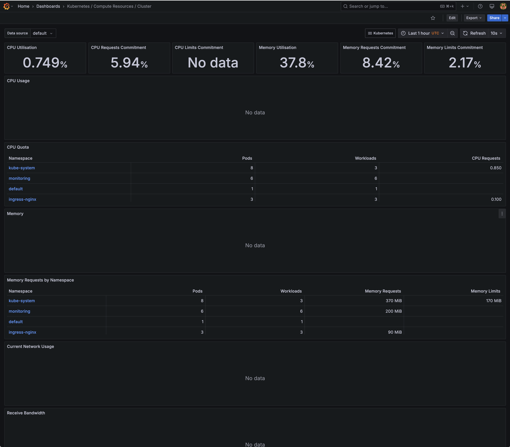
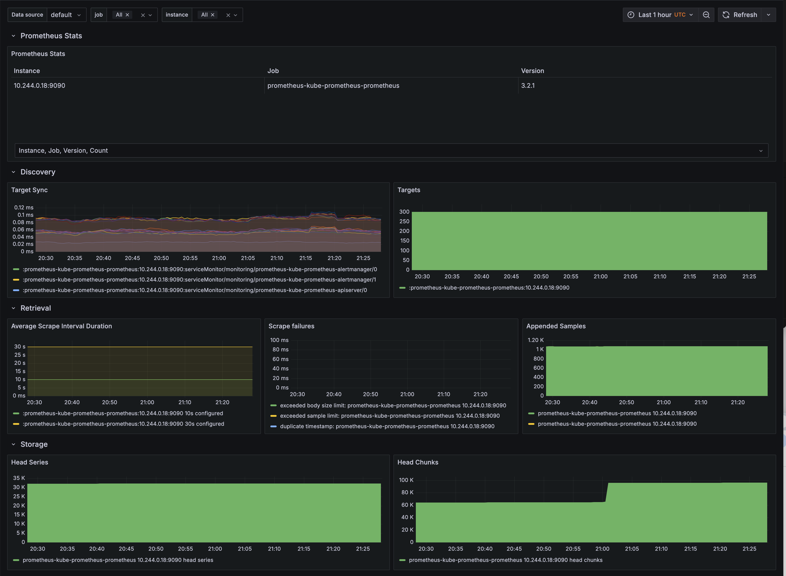

# Kubernetes Observability Stack (Minikube + Prometheus + Grafana)

This project demonstrates how to set up a full observability stack using **Prometheus** and **Grafana** on a local **Minikube Kubernetes cluster**.

## 🚀 What’s Included

- ✅ Local Kubernetes cluster via Minikube
- ✅ Prometheus (via Helm) for metrics collection
- ✅ Grafana (via Helm) for visualization
- ✅ Pre-built dashboards for Kubernetes system metrics
- ✅ Optional: Custom app to monitor (e.g., NGINX or a sample microservice)

---

## 📸 Screenshots

| Grafana Dashboards (auto-generated by kube-prometheus-stack) |
|---------------------------------------------------------------|
|               |

| Prometheus UI |
|---------------|
|  |

---

## 🧰 Prerequisites

- [Docker](https://www.docker.com/)
- [Minikube](https://minikube.sigs.k8s.io/docs/)
- [Kubectl](https://kubernetes.io/docs/tasks/tools/)
- [Helm](https://helm.sh/)

---

## 🛠️ Setup Instructions

### 1. Start Minikube

```bash
minikube start
```
> This starts a local Kubernetes cluster where everything else runs. Think of this as your own mini data center.
> Tip: Minikube runs a local Kubernetes cluster using Docker by default.

### 2. Add Helm Repos and Update
```bash
helm repo add prometheus-community https://prometheus-community.github.io/helm-charts
helm repo update
```


### 3. Create Namespace
```bash
kubectl create namespace monitoring
```

### 4. Install kube-prometheus-stack
```bash
helm install prometheus prometheus-community/kube-prometheus-stack \
  --namespace monitoring
```

### 5. Wait for Pods
```bash
kubectl get pods -n monitoring
```

### 6. Access Grafana
```bash
minikube service prometheus-grafana -n monitoring
```
> This will tunnel to Grafana on your local machine (e.g., http://127.0.0.1:51577
)

- Username: ""
- Password: ""
> Enter the username and password you set for yourself

## 📊 What You’ll See
Pre-configured dashboards showing:

- Cluster CPU and memory usage
- Per-pod and per-namespace performance
- Node metrics (via node-exporter)
- Kubernetes resource statuses

## 🧪 Optional: Deploy Sample App
Deploy a simple NGINX pod to see it show up in your dashboards:
```bash
kubectl apply -f ./manifests/nginx-deployment.yaml
```

```bash
kubectl expose deployment nginx --port=80 --type=NodePort
```

## 🧼 Cleanup
```bash
helm uninstall prometheus -n monitoring
kubectl delete namespace monitoring
minikube stop
```

## ✅ Bonus: Shell Script for Reinstalling
A helper file, ```helm-install-commands.sh```, can be used to reinstall the stack without remembering every Helm command.

## 💡 Inspiration
This setup is based on the kube-prometheus-stack Helm chart, a powerful tool maintained by the Prometheus community that installs both Prometheus and Grafana with useful dashboards and alerts out of the box.

## 🧠 What Is This Project?
This project demonstrates a basic observability stack using:

- **Minikube** to run a local Kubernetes cluster

- **Helm** to install tools into the cluster

- **Prometheus** to collect metrics from services running inside Kubernetes

- **Grafana** to visualize those metrics in dashboards

It shows how you can monitor applications running inside a Kubernetes cluster using open-source tooling — even on your laptop.

## 🧰 What's in This Stack?

| Tool             | What It Does                                                                 | Why It's Included                                                    |
|------------------|------------------------------------------------------------------------------|----------------------------------------------------------------------|
| **Kubernetes (Minikube)** | Runs containers in a local cluster                                         | This is where our example app and observability tools run            |
| **Helm**         | A package manager for Kubernetes                                             | Makes it easy to install complex tools like Prometheus + Grafana     |
| **Prometheus**   | Collects time-series metrics (like CPU, memory, request counts) from applications | Acts as the "metrics database" and scraper                         |
| **Grafana**      | Creates dashboards and graphs from Prometheus metrics                        | Helps us *visualize* what Prometheus is collecting                   |

## 📁 File Descriptions
| File                      | Purpose                                                            |
|---------------------------|--------------------------------------------------------------------|
| helm-install-commands.sh	|Bash script that installs Prometheus stack via Helm                 |
| example-deployment.yaml	  |Sample Kubernetes deployment for demo application (if used)         |
| custom-service.yaml	      |Service definition to expose demo app (optional, depending on setup)|
| README.md	                |Documentation for this project                                      |
| .gitignore	              |Prevents temporary and sensitive files from being committed         |

## 🧠 What Is Helm?
Helm is like apt or brew but for Kubernetes. It manages "charts"—packages of pre-configured Kubernetes resources. You use Helm to install and manage complex applications like Prometheus and Grafana without manually writing every YAML file.

## 🔍 What Is Prometheus?
Prometheus is an open-source monitoring and alerting toolkit. It scrapes metrics from services and stores them as time-series data. Think of it as the backend brain collecting all the numbers that Grafana will graph for you.

## 📊 What Is Grafana?
Grafana is an open-source platform for monitoring and observability. It connects to data sources like Prometheus to visualize metrics in the form of graphs and dashboards.

# Advanced Stuff

## 📝 Helm Chart Customization

This project includes example Helm value overrides for both Grafana and Prometheus.

- **helm/grafana/values.yaml** contains sample configurations for:
  - Admin credentials (username/password)
  - Data source setup (Prometheus)
  - Basic dashboard provider setup for potential custom dashboards

- **helm/prometheus/values.yaml** contains:
  - Prometheus retention policy
  - Enabled exporters (node, kube-state-metrics)
  - Alertmanager enabled

These files are optional and are not applied unless passed with `-f` during Helm install:

```bash
helm install prometheus prometheus-community/kube-prometheus-stack -n monitoring -f helm/prometheus/values.yaml
helm upgrade grafana grafana/grafana -n monitoring -f helm/grafana/values.yaml
```

They are included in this repository as templates for future customization and to show readiness for advanced configurations.

## Helm Installation Script

This repo includes a script for bootstrapping the monitoring stack using Helm. It ensures:

- The `monitoring` namespace exists
- The appropriate Helm chart repos are added
- Prometheus stack is installed (or upgraded)
- Optional: Standalone Grafana chart install using your custom `values.yaml`

To run it:

```bash
./helm-install-commands.sh
```
> Pro Tip: You want the install commands to be executable
> Make it executable with this command: ```chmod +x helm-install-commands.sh```